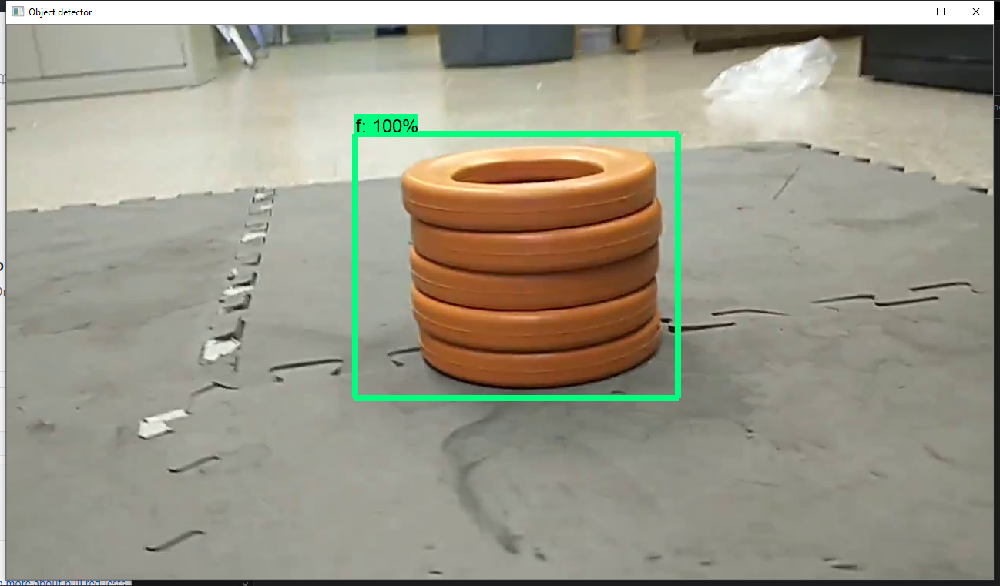

# UG-model
FTC Ultimate Goal TensorFlow Object Detection Model

Using `ssd_mobilenet_v2_coco` network.

(Note: This is floating point model, don't forget to specify in the FTC SDK when using it.)

----

Training Dataset: [GDrive Link](https://drive.google.com/drive/folders/1GYLgWjbC5fGG-ThHZkHy-I-giO6vDJ54?usp=sharing)

See [`releases`](https://github.com/ssysm/UG-model/releases) for TFLite model and Tensorflow Frozen Graph

see [`wiki`](https://github.com/ssysm/skystone-model/wiki) for installation guide

Useful Link:
  - [2019 Season's Skystone Model](https://github.com/ssysm/skystone-model)
  - [Tensorflow Object Detection](https://github.com/tensorflow/models/tree/master/research/object_detection)
  - [Tensorflow Lite](https://www.tensorflow.org/lite)
  - [`google/ftc-object-detection`](https://github.com/google/ftc-object-detection)
